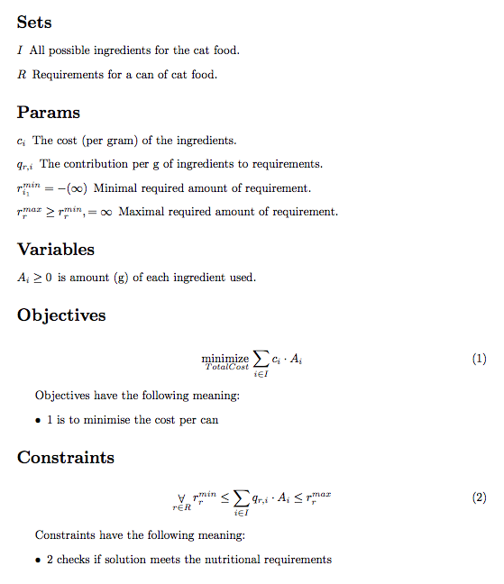

# AMPL2LaTeX

AMPL2LaTeX is AMPL to LaTeX translator that enables to easily translate AMPL optimization models into coressponding LaTeX syntax.

## Usage

Grab [latest release](https://github.com/kfigiela/ampl2latex/releases/) (or build yourself) and then run from the terminal:

```shell
$ java -jar mplt.jar input_model.mod
# Generates a lots of files in current working directory 
```

The translated version of optimization model is divided into several files and uses `glossaries` package for notation, to be easily embeded into larger document. We enriched AMPL syntax using unused *alias* feature of AMPL grammar to provide inline documentation (notation and description) for parameters, variables, objectives and constraints (see example).

## Example

Let's translate the following optimization model:

```
set INGREDIENTS "I | All possible ingredients for the cat food";
set REQUIREMENTS "R | Requirements for a can of cat food";

param Cost "c | The cost (per gram) of the ingredients" {i in INGREDIENTS};
param Contributes "q | The contribution per g of ingredients to requirements" {r in REQUIREMENTS, i in INGREDIENTS};

param Lower "r^{min} | Minimal required amount of requirement" {REQUIREMENTS} default -Infinity;
param Upper "r^{max} | Maximal required amount of requirement" {r in REQUIREMENTS} >= Lower[r], default Infinity;

var Amount "A | is amount (g) of each ingredient used" {i in INGREDIENTS} >= 0;

minimize TotalCost "is to minimise the cost per can": sum {i in INGREDIENTS} Cost[i] * Amount[i];

subject to MeetRequirements "checks if solution meets the nutritional requirements" {r in REQUIREMENTS} :
  Lower[r] <= sum {i in INGREDIENTS} Contributes[r, i] * Amount[i] <= Upper[r];
```

AMPL2LaTeX will generate a bunch of files that you may see in [example/whiskas](example/whiskas). After compilation, generated PDF will look like this:



